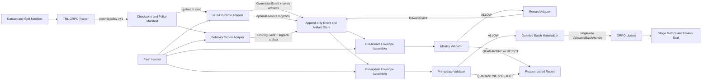

# GRPO-Guard：详细项目设计与旧项目迁移手册

> 项目状态：`PLANNED`，尚未实现、尚未发布、尚不可写成已完成开源项目  
> 建议仓库：`grpo-guard`（独立新仓库）  
> 文档版本：v1.0，2026-08-22  
> 目标读者：在看不到原 `grpo-credit-assignment` 仓库的电脑上接手实现的人

---

## 0. 先读结论

GRPO-Guard 是一个面向在线 LLM 后训练的**轨迹契约、链路校验和故障注入框架**。它不重新实现 TRL、vLLM 或 GRPO，而是在训练、rollout、behavior scoring、reward 和 optimizer update 之间建立可机器校验的证据链，优先发现以下静默错误：

1. trainer 已更新，但 rollout runtime 仍在使用旧策略；
2. `old_logprob` 并非由真正生成该轨迹的 behavior policy 产生；
3. rollout 使用的 token 序列与 trainer 重新编码后的序列不同；
4. completion/action mask 错选 prompt、padding 或相邻 token；
5. 后续版本扩展到训练/评测 split 泄漏和 reward/evaluator alias。

v0.1 的核心交付不是“模型分数提升”，而是：

- 在一个真实 `TRL + vLLM` GRPO 小模型闭环中完成一次 `update → commit → sync → new rollout`；
- 冻结 F1–F4 四类故障及正常/边界样例；
- 正常轨迹能够通过，违规轨迹被 reason-coded 地拒绝或隔离；
- 从同一份 producer artifact 派生正确/故障 pair，量化错误被静默接受时的梯度影响；
- 给出 guard 开销、完整 manifest、checksums、测试和 clean-environment 复现记录。

本项目必须新建干净仓库，不能把旧 `grpo-credit-assignment` 仓库改名后继续开发。旧仓库高度 dirty，且包含投稿、失败路线、旧模型、运行日志和未跟踪文件；它只作为**事故档案和迁移来源**。

---

## 1. 项目定位

### 1.1 一句话定义

> 在固定 GRPO workload 上，将 behavior policy、原始 token/log-prob/mask、数据、reward 和 evaluator lineage 封装为不可随意改写的 trajectory envelope；用事件顺序、内容哈希和协议规则校验其是否可以进入一次 optimizer update，并用冻结故障进行确定性回归。

### 1.2 求职价值

这个项目证明的不是“我会调用 Trainer”，而是以下工程能力：

- 能把算法正确性翻译成系统不变量；
- 理解 on-policy、policy lag、behavior log-prob 和 importance correction 的边界；
- 能把 vLLM rollout 与 trainer 权重生命周期接起来并观测；
- 能处理 token identity、mask、padding、truncation 等训练数据契约；
- 能做 fault injection、paired replay、reason-coded diagnosis 和可复现 release；
- 遇到漂亮但不可信的曲线时，能停止使用结论、定位根因并建立回归保护。

它适合作为大模型后训练算法工程、训练系统、Agent RL Infra、评测可靠性等岗位的工程主项目。

### 1.3 与 Agent-RL Credit Auditor 的边界

| 项目 | 主要问题 | 运行位置 | 首版算力 | 核心输出 |
|---|---|---|---:|---|
| GRPO-Guard | “这条轨迹和这次更新的身份链闭合吗？” | 在线训练/rollout 链路 | 2×A800，约 30–36 GPU·h | envelope、validator、fault matrix、replay、overhead |
| Agent-RL Credit Auditor | “这个 credit estimator 到底估计什么，固定成本下是否有效？” | 离线 exact/simulation 审计 | CPU-first | estimand contract、oracle、matched-cost benchmark、机制审计 |

Guard 不能证明一个新 credit estimator 有效；Auditor 也不能替代在线 policy/token identity 校验。二者可通过共同的 trajectory artifact 格式对接，但必须是两个独立仓库。

### 1.4 v0.1 非目标

v0.1 明确不做：

- 自研 GRPO、PPO、vLLM、continuous batching 或权重同步算法；
- 多模型、多任务、多后端、大而全训练平台；
- 7B/14B 长训练、8 卡 scaling 或 SOTA 质量结果；
- 密码学防篡改、恶意 producer 对抗或生产级安全证明；
- 自动验证任意 off-policy correction 的数学正确性；
- 迁移旧 CPC/PC-RSG/RMTPG 为“新算法”；
- 在没有真实 Ascend 硬件运行证据时声称完成 NPU 迁移。

---

## 2. 原 `grpo-credit-assignment` 项目：必须继承的失败经验

这一节是新电脑无法访问旧仓库时的事故手册。实现者应把它当作需求来源，而不是背景故事。

### 2.1 原项目当前结论

截至 2026-08-21，旧项目的权威状态是：

- 阶段：`cpu_rediscovery_closed_no_surviving_paper_route`；
- 状态：`paused`；
- 选择结果：所有选中的 CPU 路线均被淘汰或降为 support-only；
- 没有 active milestone，也没有获准继续的 GPU run；
- 当前工作树有大量 tracked modifications 和 untracked files，不能当作 release；
- 审计是同模型家族、上下文隔离的 provisional review，不等于独立科学审稿。

因此，旧项目不能再讲成“提出了有效的 Agent credit 方法”。它可讲成：发现线上训练完整性故障，随后建立 exact benchmark，主动淘汰不成立的方法机制，并把事故抽象为 Guard。

### 2.2 最严重事故：静态 rollout policy

旧 trainer 在初始化时只创建一次外部 rollout client，连接固定 `model_url/model_name`。训练循环会更新本地 trainer 权重和 loss/KL，但没有在每次迭代后把新权重同步到 rollout 服务。

后果是：

```text
rollout service:  policy_v0 ──────────────── policy_v0
trainer:          policy_v0 → policy_v1 → policy_v2 → policy_v3
reported SR:      static policy 的批次波动，不是训练后策略表现
loss / KL:        本地 trainer 确实在更新，所以看起来“训练正常”
```

以下旧叙事因此无效，严禁迁移到新项目：

- GRPO 成功率 `36.5% → 63.5%`；
- pilot 成功率 `4.7% → 10.9%`；
- 主表、静态控制和消融中的 per-iteration success 曲线；
- 任何根据这些曲线推断“credit 方法改善学习”的结论。

Guard 对应需求：每条 generation 必须绑定 runtime 实际加载的 policy version、checkpoint manifest、sync event 和 load epoch；validator 不能只相信 trainer 声称的“当前版本”。

### 2.3 `old_logprob` policy 身份不闭合

旧代码在 trainer 侧，用本地当前模型对重建后的文本重新计算 `old_logp`；但轨迹来自另一个静态服务。两者没有共同的 checkpoint、tokenizer、chat template 或 event identity。

这会把“某个模型对某个重编码序列的 log-prob”误标成“生成该动作的 behavior log-prob”。即便数值看起来合理，PPO/GRPO ratio 的语义已经不成立。

Guard 对应需求：

- 若 rollout 服务直接返回 log-prob，它必须与 token 一起由同一个 `generation_event` 生产；
- 若需要独立精确重算，必须由绑定 behavior checkpoint 的 scorer 产生 `scoring_event`；
- scorer checkpoint 必须等于 generation behavior checkpoint；
- scoring event 必须引用同一 generation/token artifact，且先于 consuming update；
- assembler/trainer 不得从文本偷偷重算后继续沿用 `old_logprob` 名称。

### 2.4 token identity 不闭合

旧 rollout 端使用 messages + server chat template 采样；trainer 把 `prompt + completion` 拼成普通字符串后重新 tokenize。以下因素都可能导致 token 序列不同：

- tokenizer revision 不同；
- chat template 不同；
- BOS/EOS/assistant prefix 处理不同；
- whitespace、Unicode normalization 或特殊 token 不同；
- padding side、truncation side、最大长度不同；
- rollout 返回的字符串无法唯一逆推出真实采样 token。

Guard 对应需求：训练必须消费 producer 保存的原始 token IDs 和 canonical spans。文本用于阅读和调试，不能成为训练身份的权威来源。

### 2.5 completion/action mask 错位

旧 completion mask 以 `masks[i, T-comp_len[i]:]` 方式选最后若干位置，在 padding、截断或不同 padding side 下可能错误。action mask 使用第一次 `str.find(action)`，遇到重复文本、prompt 中同名片段、多字节字符或截断时不安全。

Guard 对应需求：

- generation event 明确记录 prompt/completion token span；
- mask 从 token boundary 构造，而不是从字符串 substring 猜测；
- validator 独立重建 canonical mask 并逐元素比对；
- 必测 prompt 泄漏、padding 泄漏、重复 action、零长度、截断和 EOS 边界。

### 2.6 “论文方法”与 production path 不一致

旧 CPC 声称四级 procurement：

1. T1 natural same-prefix siblings；
2. T2 restored-prefix rerolls；
3. T3 sandbox forks；
4. T4 global fallback。

但 `plan_procurement` 只被单元测试调用，实际训练的 `compute_advantages` 只使用 T1 自然 sibling。另一个 `cpc_alltoken` 消融仍把 credit 写到 action-token spans，并不是真正的 all-token 对照。

Guard 对应需求：所有声明启用的 feature 必须有运行时事件或 coverage 证明。只有配置字段、死代码和单元测试不构成 production execution evidence。

### 2.7 split 和 evaluator 口径错误

旧 `eval_policy.py` 调用 `collect_games()` 时未传 split，loader 默认 `train`，而论文称 frozen dev/held-out。数值可以真实存在，但 split 标签不成立。

Guard v0.1 先记录显式 split manifest；F5 split leakage 在 v0.2 实现。任何 train/calibration/test 都要通过 ID 与内容哈希检查互斥。

### 2.8 环境与 oracle 退化

旧 ALFWorld 替代动作大多是可恢复 no-op，86%–88% 的 fork oracle 值正好为 0。旧 ToolEnv 的 per-rollout 随机性只改变物品或城市名，不改变要求的工具调用序列，导致同组全成功或全失败，多个估计器恒定。曾报告的 `ρ=0.735` 来自错误归一化制造的伪方差，严禁再使用。

Guard 的启示不是“负责改好 credit oracle”，而是：

- reward/evaluator 必须有版本和 protocol hash；
- 环境 timeout、infra error、invalid output 不能静默记成 reward 0；
- 结果报告要包含非退化诊断，如 reward variance、非零 advantage 组比例、解析失败率；
- Guard 只负责 lineage 和错误分类，不替代任务有效性研究。

### 2.9 旧项目仍可信但范围很窄的结果

这些数字可作为事故说明或 Auditor 回归基准，不能作为 Guard 的正向结果：

| 结果 | 可用范围 | 禁止外推 |
|---|---|---|
| ALFWorld between-prefix 方差占比 `0.18 → 1.00` | simulation phenomenon | 不能说训练方法有效 |
| pilot KL `0.98 vs 1.31` | 单 seed、训练侧方向 | 不能说任务性能改善 |
| main KL `0.20 vs 0.25` | 5 seeds、方向但不显著 | 不能写稳定显著提升 |
| ALFWorld fixed eval：SFT `7.3%`、GRPO `5.6%`、CPC `6.0%` | null/negative evidence | 无方法超过起点 |
| ToolEnv fixed eval：三者均 `52.8%` | 环境退化证据 | 不能解释成算法等价 |

### 2.10 从事故抽出的十条硬不变量

新实现必须保留以下不变量：

1. iteration `t` 的 rollout policy 与该更新使用的 behavior log-prob policy 必须可按 checkpoint 内容身份对应；
2. rollout 实际采样的 chat-template token 序列必须是 trainer 优化的序列；
3. completion/decision masks 必须来自精确 token boundary，不得包含 prompt 或 padding；
4. train、calibration、held-out manifests 必须显式且互斥；
5. restored branch 的 action/continuation 必须按声明协议从正确策略采样；
6. local sibling advantage 只能更新分支 action，不得无证明地传播到已共享 prefix；
7. adaptive decision sampling 必须有正支持、预先可知且记录的概率，并匹配 HH/HT correction；
8. branch residual 与 dense proxy 在声称 target-preserving 前必须匹配 state-action marginals；
9. oracle alternatives 必须 admissible、state-changing、policy-consistent、non-degenerate；
10. 对照必须匹配任务、样本、rollout-token budget、评测入口和 baseline 实现。

其中 1–4 是 GRPO-Guard 的直接范围；5–10 主要由 Credit Auditor 负责，但 Guard 应保留相应 lineage 字段。

---

## 3. 旧资产的迁移分级

### 3.1 可迁移的设计模式

以下模式应重新实现或经过 provenance 清洗后移植：

- 冻结 JSON protocol 和显式 seed/task manifests；
- calibration/test 先冻结、后实现 confirmatory evaluation；
- content SHA-256、source/config/artifact lineage；
- canonical 输出 no-overwrite；
- `result.json + run_manifest.json + REPORT.md + SHA256SUMS`；
- 独立 oracle 不导入被测实现；
- 失败 Gate、REVISE 记录和 kill memo 不删除；
- matched-cost 与明确的预算单位。

这些资产是旧项目最有价值的工程部分。

### 3.2 只可作为负例 fixture 的旧逻辑

以下旧逻辑不能作为正确实现迁移，只能手工重建成最小故障用例：

- 静态外部 rollout service；
- trainer 侧把当前模型 log-prob 当 behavior old-logprob；
- `prompt + completion` 重新 tokenization；
- `T-comp_len` completion mask；
- 基于第一次 `str.find` 的 action mask；
- 未指定 split 而依赖默认 `train`；
- 仅在测试调用、production 不执行的 procurement tiers；
- 名义 all-token、实际仍只更新 action tokens 的假消融。

不要整文件复制旧 `train_grpo.py` 后“逐步修”；应在新仓库写最小、透明的 fault injector。

### 3.3 不应迁移的重资产

旧仓库内两份 4B 模型约各 7.5 GB，模型目录合计约 16 GB；runs 约 7.5 GB，日志约 32 MB，formal logs 约 74 MB。新仓库不应复制：

- `models/Qwen3-4B-SFT-ALF`；
- `models/Qwen3-4B-CPC-iter2`；
- 大体积 runs/checkpoints；
- 与匿名投稿绑定的未公开方法代码；
- 本机绝对路径 `/root/autodl-tmp/...`。

只迁移小型、可审计、许可证明确的 fixture 和机器可读摘要。

### 3.4 迁移时的 provenance 警告

旧仓库的内部 hashes 一致，但工作树 dirty/untracked，不能把它们描述为 Git 或外部不可篡改证明。迁移时应：

1. 记录旧文件相对路径、旧 SHA-256、迁移时间和迁移者；
2. 对迁移后的规范化文件重新计算新 SHA-256；
3. 保存 `legacy_source_sha256 → new_artifact_sha256` 映射；
4. 对手工重写的 fixture 标记 `reconstructed_from_incident`，不要伪装成 byte-identical copy；
5. 新仓库从首个 commit 起保持 clean release lineage。

---

## 4. v0.1 固定范围与成功定义

### 4.1 固定 workload

- 模型：`Qwen/Qwen2.5-1.5B-Instruct`，固定 revision；
- 任务：Countdown，显式冻结 train/eval manifests；
- reward：确定性规则 verifier；
- 训练：TRL GRPO；
- rollout：vLLM server；
- 主资源布局：GPU 0 trainer，GPU 1 rollout；
- 精度：优先 BF16；
- 更新：至少一次真实 committed optimizer update；
- 同步：使用并观测上游支持的 weight-sync 生命周期；
- v0.1 faults：F1–F4。

如模型不可获取，可换同量级、已缓存的 instruct model，但必须在第一次正式运行前修改 protocol 并记录原因，不能看过结果后换模型。

### 4.1.1 开工前必须冻结的兼容矩阵

本设计文档不把未经本机 smoke 的依赖版本伪装成已验证组合。实现电脑在写 adapter 前必须生成 `compatibility_profile.yaml`，至少固定：

```yaml
profile_id: cuda-a800-server-v01
python: exact-version
torch: exact-version
cuda_runtime: exact-version
cuda_driver: exact-version
transformers: exact-version
trl: exact-version
vllm: exact-version
accelerate: exact-version
model_id: Qwen/Qwen2.5-1.5B-Instruct
model_revision: immutable-commit
trl_mode: server
trainer_cuda_visible_devices: [0]
rollout_cuda_visible_devices: [1]
serve_command: [trl, vllm-serve, --model, ...]
trainer_config:
  use_vllm: true
  vllm_mode: server
upstream_sync_adapter:
  python_qualname: exact-observed-hook
  source_file_sha256: ...
  request_or_collective: exact-observed-path
official_smoke_passed: true
```

截至本文日期，TRL 官方文档说明 server mode 通过 `trl vllm-serve` 与 `GRPOConfig(use_vllm=True, vllm_mode="server")` 使用独立 GPU，并给出其当前支持的 vLLM 版本范围；这些信息会变化，所以只能作为候选起点，最终权威是本项目 lock、profile 和成功 smoke，而不是网页的 `latest` 页面：[TRL vLLM integration](https://huggingface.co/docs/trl/vllm_integration)、[GRPOTrainer](https://huggingface.co/docs/trl/grpo_trainer)。

Compatibility Gate：官方最小 server-mode GRPO smoke、一次真实 optimizer commit 和一次上游 sync 均成功，且 adapter 能观测具体 hook/request/ack；否则不得开始 F1 在线实验。若只能通过重启 server 加载 checkpoint，也必须把“drain → stop → load → health/canary → serve”写成实际 backend，不得沿用热同步表述。

### 4.2 成功定义

v0.1 成功需要同时满足：

- 真实在线闭环不是 mock：`v0 rollout → v1 committed update → runtime sync v1 → v1 rollout`；
- validator 的数据来源是事件和 raw artifacts，不是 assembler 自报字符串；
- canonical F1–F4 全部按预注册规则被 reject/quarantine；
- normal set 无 false reject；
- boundary/unknown cases 按预定义规则稳定处理；
- F2–F4 paired replay 能重现可解释的 gradient/ratio 差异；
- F1 strict 模式被阻止更新，并报告错误接收时的 update norm；
- clean environment 能安装、跑 CPU tests 和 GPU smoke；
- 所有发布数字都有 artifact、manifest、commit 和 checksum。

“accuracy 没提升”不构成项目失败；“无法证明训练消费的是正确轨迹”才构成失败。

---

## 5. 信任模型与威胁边界

### 5.1 信任的组件

v0.1 假设以下组件非恶意，但可能出现配置或集成错误：

- trainer control plane；
- rollout runtime adapter；
- behavior scorer adapter；
- append-only event/artifact store；
- validator。

### 5.2 要检测的错误

- 忘记同步、错载 checkpoint、版本落后；
- token 被重新编码或截断边界变化；
- log-prob 引用错 policy 或错 generation；
- mask 平移、越界或选到 prompt/padding；
- 缺失 lineage、事件乱序、artifact hash 不匹配；
- 配置声明 strict，但实际消费 stale trajectory。

### 5.3 不处理的攻击

若恶意 producer 同时伪造事件、tensor、checkpoint hash 和 canary，v0.1 无法提供密码学不可抵赖性。因此只使用“校验、检测、拒绝、隔离、审计证据”等表述，不使用“绝对证明”“防篡改安全系统”。

---

## 6. 系统架构



### 6.1 Producer ownership

| 对象 | 唯一 producer | 禁止行为 |
|---|---|---|
| `SyncEvent` | trainer control plane / upstream sync adapter | runtime 自报“已同步”但无控制面事件 |
| `GenerationEvent` | runtime adapter | trainer/assembler 伪造 generation |
| prompt/completion token tensors | runtime adapter | 从文本重新 tokenize 后覆盖 |
| service-returned behavior logprobs | runtime adapter，同 generation event | 另一个 policy 产生后仍标 service-returned |
| recomputed behavior logprobs | scorer adapter，独立 scoring event | trainer current model 无事件重算 |
| canonical completion mask | runtime adapter 初始产生，validator 独立重建 | assembler 改写 mask |
| `RewardEvent` | reward adapter | 把 timeout/infra error 静默当 reward 0 |
| `UpdateEvent` | trainer control plane | optimizer 未提交却递增 policy version |
| `UpdateInputEvent` / `ValidatedBatchHandle` | guarded batch materializer | validator 后重新 tokenize；绕过 handle 直接传文本 |
| `TrajectoryEnvelope` | reference-only assembler | 生产或修改 tensor；把 pre-reward 与 pre-update 阶段混为一谈 |
| `ValidationDecision` | validator | 只相信 envelope 的 provenance 文本 |

### 6.2 生命周期状态机

```text
POLICY_COMMITTED(v)
    → SYNC_REQUESTED(v)
    → RUNTIME_LOADED(v, load_epoch)
    → CANARY_CHECKED(v)
    → GENERATION_STARTED(v)
    → GENERATION_FINISHED(v, token_artifacts)
    → [SCORING_FINISHED(v, logprobs)]
    → PRE_REWARD_ENVELOPE_ASSEMBLED(reference-only)
    → IDENTITY_VALIDATED(allow | quarantine | reject)
    → REWARD_FINISHED
    → PRE_UPDATE_ENVELOPE_ASSEMBLED(reference-only)
    → PRE_UPDATE_VALIDATED(allow | quarantine | reject)
    → UPDATE_INPUT_MATERIALIZED(exact artifact refs)
    → UPDATE_STARTED(parent=v)
    → UPDATE_COMMITTED(v+1)
```

只有 identity validation 为 `ALLOW` 才计算正式训练 reward；只有 pre-update validation 为 `ALLOW` 才能生成单次 `ValidatedBatchHandle`，而 guarded trainer 的 update API 只接受该 handle，不接受 prompt/completion 字符串。pre-reward envelope 中 `reward_event=null` 是合法的，pre-update envelope 中它是必填项。所有 lifecycle event 使用 run 内严格递增的 `lifecycle_seq`。失败事件也保留，不允许重用同一个 event ID 覆盖。

### 6.3 policy version 定义

`policy_version` 仅在以下条件同时满足后递增：

1. optimizer step 完成；
2. checkpoint/adapter 权重完整写入临时位置；
3. manifest 与 hashes 完成；
4. 原子提交成功；
5. `UpdateCommitted` event 写入。

它不是 micro-step、gradient accumulation step、rollout batch index 或 WandB global step。

---

## 7. 数据模型

建议用 Pydantic v2 定义，JSON 序列化采用 UTF-8、排序 key、禁止 NaN/Infinity 的 canonical form。

### 7.1 通用 artifact reference

```python
class EventRef(BaseModel):
    uri: str
    event_id: str
    event_sha256: str

class EnvelopeRef(BaseModel):
    uri: str
    envelope_id: str
    envelope_sha256: str

class ArtifactRef(BaseModel):
    uri: str
    media_type: str
    dtype: str | None = None
    shape: list[int] | None = None
    num_bytes: int
    sha256: str
    producer_event_id: str
```

artifact 内容不可通过 envelope 内联后再次规范化。validator 读取 bytes，重新计算 SHA-256，再解析 shape/dtype。这里使用预先分配的 `producer_event_id` 而不是 producer event hash，是为了避免“event hash 包含 artifact ref、artifact ref 又包含 event hash”的自引用环。

### 7.2 PolicyManifest

```python
class PolicyManifest(BaseModel):
    manifest_id: str
    model_id: str
    model_revision: str
    policy_version: int
    parent_policy_version: int | None
    weights: list[ArtifactRef]
    checkpoint_manifest_sha256: str
    tokenizer_sha256: str
    chat_template_sha256: str
    precision: str
    adapter_kind: Literal["full", "lora", "qlora"]
    base_model_sha256: str | None
    adapter_sha256: str | None
    code_commit_sha: str
    config_sha256: str
```

`checkpoint_manifest_sha256` 从去除自身 hash 字段后的 canonical manifest JSON 计算并封存，规则与 event 相同。若使用 LoRA，base 与 adapter 身份必须分开；只 hash adapter 不足以识别完整 behavior policy。

### 7.3 事件基类

```python
class EventBase(BaseModel):
    schema_version: str
    event_id: str
    event_type: str
    run_id: str
    component_id: str
    lifecycle_seq: int
    created_at_utc: str
    input_events: list[EventRef]
    input_artifacts: list[ArtifactRef]
    output_artifacts: list[ArtifactRef]
    event_sha256: str
```

event producer 先分配不可复用的 UUID/ULID `event_id`，artifact refs 只引用该 ID；所有 artifact bytes 与 refs 写完后，再从去除 `event_sha256` 字段的 canonical event JSON 计算 `event_sha256` 并 seal。后续消费者用 `(event_id, event_sha256)` 引用已封存事件。事件封存后，store 另写一条不参与 producer event hash 的 provenance edge：`(event_id, event_sha256, artifact_sha256, role)`。事件封存后不得修改；任何修订都生成新 event ID。这样 event → output artifact 的内容哈希是单向的，不形成哈希环。

#### 7.3.1 SyncEvent

一次 sync 的每个 phase 都是独立、不可变事件，共享 `sync_id`，不能原地更新同一 JSON：

```yaml
event_type: >-
  sync_requested | sync_started | runtime_loaded | canary_passed |
  sync_unknown | sync_reconciled_canary_passed | sync_retryable_old |
  sync_quarantined | sync_failed | sync_attempt_superseded
sync_id: sync-run-policy7-runtime1
attempt: 1
supersedes_attempt: null
lease_epoch: 4
idempotency_key: "<run_id>:<policy_version>:<runtime_id>"
source_policy_version: 7
source_checkpoint_manifest_sha256: ...
target_runtime_id: rollout-gpu1
previous_runtime_load_epoch: 2
observed_runtime_load_epoch: 3
observed_policy_version: 7
upstream_adapter_id: trl-vllm-server-<profile>
upstream_operation: exact-hook-or-request-name
compatibility_profile_sha256: ...
status_detail: null | ...
```

`runtime_loaded` 只表示上游返回加载成功；正常路径的 `canary_passed` 或 UNKNOWN 恢复路径的 `sync_reconciled_canary_passed` 才允许新 generation。sync retry 保持同一 `sync_id/idempotency_key`、递增 `attempt`、使用新 event IDs；已经进入上述任一 terminal success 的同一目标重复请求必须返回幂等成功，不能再次递增 load epoch。冲突成功、晚到 callback 和未知状态统一按 §7.3.4 reducer 处理。

#### 7.3.2 UpdateEvent

```yaml
event_type: >-
  update_started | update_prepared | update_unknown | update_committed |
  update_restored_parent | update_aborted | update_attempt_superseded
update_id: update-000008
transaction_id: txn-...
attempt: 1
supersedes_attempt: null
lease_epoch: 9
idempotency_key: "<run_id>:<update_id>"
parent_policy_version: 7
output_policy_version: null | 8
input_preupdate_envelope_sha256s: [...]
update_input_event: EventRef
gradient_accumulation_microbatches: 4
optimizer_step_count_delta: 1
trajectory_use_policy: consume_once_v01
checkpoint_manifest_sha256: null | ...
optimizer_state_artifact: null | ArtifactRef
failure_code: null | ...
```

同一 `update_id` 最多存在一个 authoritative `update_committed`；失败重试沿用 transaction/update ID、递增 attempt。`update_aborted` 不创建新 policy version。若 checkpoint 已写但 commit event 未成功，checkpoint 进入 orphan quarantine，不能被 runtime 自动加载。

#### 7.3.3 UpdateInputEvent 与受控消费

pre-update validator 的 `ALLOW` 之后，materializer 从 content-addressed store 重新读取并校验 bytes，只按 §7.9 生成训练张量：

```yaml
event_type: update_input_materialized
update_id: update-000008
preupdate_envelope: EnvelopeRef
preupdate_validation_decision: EventRef
sequence_token_ids: ArtifactRef
loss_mask: ArtifactRef
authoritative_behavior_logprob_event: EventRef
authoritative_behavior_logprobs: ArtifactRef
reward_event: EventRef
materialized_layout_sha256: ...
single_use_nonce_sha256: ...
tokenizer_called: false
```

内存中的 `ValidatedBatchHandle` 只封装该 sealed event、单次 nonce 和 tensor views；update adapter 在 `update_started` 时原子消费 nonce。guarded mode 的公开 update API 不接收文本，也不暴露“重新 tokenize 后继续”的 fallback。integration test monkeypatch tokenizer 为抛异常，仍应完成合法 update；故障 fixture 若试图传文本、替换 artifact ref 或复用 nonce，必须在 optimizer 前失败。

这个设计能证明受控 adapter 消费了哪些 source bytes 和布局；在非恶意信任模型下，它不构成对任意第三方 CUDA kernel 的密码学证明。若目标 TRL 版本无法在不重写核心算法的情况下接入 exact token batch，Compatibility Gate 失败，项目降级为 CPU contract prototype，不能声称真实 Guarded update 闭环。

#### 7.3.4 retry、竞态与不确定提交

v0.1 固定为单机、每个 runtime/update 一个 single-writer lease；lease 带单调 fencing epoch。新 attempt 显式写 `supersedes_attempt`，旧 attempt 随即为 `SUPERSEDED`，其晚到 callback 只能作为诊断事件，不能推进状态。状态由 append-only events 通过确定性 reducer 推导，不能由“最后一行日志”随意覆盖：

```text
sync:   NEW → REQUESTED → STARTED → LOADED → CANARY_PASSED
                              └→ UNKNOWN → RECONCILED_CANARY_PASSED / RETRYABLE_OLD / QUARANTINED
                              └→ FAILED

update: NEW → STARTED → PREPARED → COMMITTED
                    └→ UNKNOWN → COMMITTED / RESTORED_PARENT
                    └→ ABORTED
```

Sync 请求 timeout 一律进入 `UNKNOWN` 并停止 generation。reconciler 查询 runtime health/load epoch，再跑 target/previous 两套 canary：只匹配 target 时补写 `sync_reconciled_canary_passed` 并继续；只匹配 previous 时写 `sync_retryable_old`，再用同一 idempotency key 重试；两者都不匹配或证据冲突时写 `sync_quarantined`、排空并重启 runtime，当前轨迹全部 quarantine。若 superseded attempt 晚到“成功”，即使回调声称成功也先写 `sync_unknown` 并按实际 runtime/canary reconciliation，不能按 callback 时间覆盖新 attempt。

Update 开始前保存 parent model/optimizer/RNG 与 trajectory-consumption ledger 的 recovery bundle。每个写入/commit 检查当前 lease fencing epoch，stale attempt 无权发布。optimizer step 后先把 checkpoint、manifest 和 `update_committed` event 写入同一临时 transaction directory，校验完后以一次原子目录 rename 发布 `COMMITTED`。恢复时：完整 committed directory + checksums 是唯一权威；只有 `PREPARED`/临时目录而无 commit marker，则隔离 orphan、恢复 exact parent bundle，并以同一 update/batch IDs 重试，绝不能在未知权重上再 step 一次。

同一 ID 出现两个不同 committed payload、lease 重叠或 terminal states 冲突时，整个 run 标为 `INVALID_CONFLICTING_COMMIT` 并停止自动推进。这个协议依赖单机文件系统的原子 rename 与 single-writer lease；多机共识和网络分区不属于 v0.1。

### 7.4 GenerationEvent

最少字段：

```yaml
event_type: generation_finished
request_id: req-...
attempt_id: attempt-...
prompt_id: countdown-...
sample_index: 0
runtime_id: rollout-gpu1
runtime_load_epoch: 3
behavior_policy_version: 7
checkpoint_manifest_sha256: ...
sync_event: EventRef                   # canary_passed 或 sync_reconciled_canary_passed
sampling_config_sha256: ...
tokenizer_sha256: ...
chat_template_sha256: ...
prompt_span: [0, 83]
completion_span: [83, 141]
padding_spans: []
truncation_applied: false
terminal_status: success
sequence_token_ids: ArtifactRef
completion_target_mask: ArtifactRef
loss_mask: ArtifactRef
service_behavior_logprobs: null | ArtifactRef
```

`sequence_token_ids` 是 runtime 实际采样并交给 trainer 的权威序列；prompt/completion 文本和分段 token 只能作为它的只读视图，不能反向重编码后覆盖。span 统一使用半开区间 `[start, end)`，基于该权威序列坐标。

### 7.5 ScoringEvent

```yaml
event_type: behavior_scoring_finished
source_generation_event: EventRef
scorer_policy_version: 7
scorer_checkpoint_manifest_sha256: ...
token_artifact_sha256: ...
scoring_dtype: bf16
behavior_logprobs: ArtifactRef
```

必须满足：scorer policy/checkpoint 与 generation behavior policy/checkpoint 相同，且 token artifact 完全相同。

### 7.6 RewardEvent

```yaml
reward_version: countdown-rule-v1
evaluator_protocol_sha256: ...
source_generation_event: EventRef
components:
  correctness: 1.0
  format: 1.0
terminal_status: success
latency_ms: 3.2
```

`timeout`、`infra_error`、`invalid` 与 `task_fail` 是不同状态；只有协议显式定义后才映射为训练 reward。

### 7.7 TrajectoryEnvelope

envelope 只保存引用：

```yaml
envelope_id: envelope-...
envelope_sha256: ...
envelope_stage: pre_reward | pre_update
run_id: ...
request_id: ...
generation_event: {uri: ..., event_id: ..., event_sha256: ...}
scoring_event: null | {uri: ..., event_id: ..., event_sha256: ...}
reward_event: null | {uri: ..., event_id: ..., event_sha256: ...}
policy_manifest: {uri: ..., sha256: ...}
split_manifest: {uri: ..., sha256: ...}
parent_envelope_sha256: null | ...
parent_identity_decision: null | {uri: ..., event_id: ..., event_sha256: ...}
training_contract:
  protocol: strict_on_policy
  trainer_parent_policy_version: 7
  consuming_update_id: update-8
  max_policy_lag_versions: 0
  importance_correction: null
  behavior_logprob_source: generation_service | exact_behavior_scorer
  authoritative_behavior_logprob_event: {uri: ..., event_id: ..., event_sha256: ...}
  diagnostic_non_authoritative_logprobs_allowed: false
```

`envelope_sha256` 从去除自身 hash 字段的 canonical JSON 计算并封存。三个 event 字段都使用完整 `EventRef`。pre-reward envelope 的 `reward_event` 必须为 null；pre-update envelope 必须引用 RewardEvent，并同时通过 `parent_envelope_sha256` 与 `parent_identity_decision` 连接已经 `ALLOW` 的 pre-reward envelope。不允许 envelope 携带一份与 artifact 冲突的 token/logprob/mask 副本。

behavior log-prob 没有隐式 precedence：training contract 必须恰好选择一个 authoritative source。选择 `generation_service` 时，authoritative event 必须是 generation event，且它必须携带 service logprobs；选择 `exact_behavior_scorer` 时，authoritative event 必须是匹配 behavior checkpoint/token 的 scoring event。两路同时存在且 `diagnostic_non_authoritative_logprobs_allowed=false` 时直接拒绝；该字段为 true 时，另一条只能用于差异诊断并明确标为 non-authoritative，不能进入 loss/ratio 或 `UpdateInputEvent`。选中的 source 缺失、两路都被标 authoritative 或 materializer 引用错误 event 均 fail closed。

### 7.8 ValidationDecision

```yaml
decision: allow | quarantine | reject
validation_stage: identity_pre_reward | full_pre_update
reason_codes: [G001_POLICY_MATCH, T001_TOKEN_HASH_MATCH]
checked_ruleset_sha256: ...
checked_event_sha256s: [...]
checked_artifact_sha256s: [...]
observed_policy_lag: 0
validator_version: ...
```

该 payload 封装在 `event_type=validation_decision` 的 EventBase 中，因此可以被下一阶段用完整 EventRef 引用。`quarantine` 用于信息不足或可恢复的未知状态；`reject` 用于协议明确违规；`allow` 仅在该 validation stage 的所有 required checks 完成后出现。identity Gate 的 `ALLOW` 只授权 reward 计算，不授权 optimizer update。

### 7.9 causal-LM token/log-prob/mask 对齐约定

为避免“token mask”和“shift 后的 loss mask”混为一谈，v0.1 固定以下布局。设权威序列长度为 `T`，prompt/completion 分界为 `P`，completion 长度 `C=T-P`：

```text
sequence_token_ids:       shape [T]
completion_target_mask:   shape [T], indices [P, T) 为 1
next_token_logits:         conceptual shape [T-1, V]
loss_mask:                 shape [T-1], indices [P-1, T-1) 为 1
behavior_logprobs:         shape [C], 依次对应 target tokens [P, T)
prediction_positions:     [P-1, P, ..., T-2]
```

也就是说，target token `sequence_token_ids[j]` 由模型输出位置 `j-1` 的 logits 预测。validator 必须从 `completion_span` 独立重建 `completion_target_mask`、`loss_mask` 和 `prediction_positions`，再检查 behavior log-prob 第 `k` 项是否对应 target `P+k`。若 `P=0`、`C=0`、序列已截断或上游返回的 log-prob 包含 prompt 部分，必须走显式协议分支，不能靠长度猜测。

如果上游 adapter 使用 packed sequence 或不同张量布局，它可以保存额外 layout metadata，但进入 v0.1 validator 前必须规范化到上述逻辑坐标；原始 upstream tensor 仍作为 source artifact 保留。

---

## 8. Validator 规则与 reason codes

### 8.1 policy / lifecycle

| Code | 条件 | 默认决策 |
|---|---|---|
| `P001_MISSING_POLICY_MANIFEST` | generation 无 policy manifest | reject |
| `P002_CHECKPOINT_HASH_MISMATCH` | event 与 manifest checkpoint hash 不同 | reject |
| `P003_MISSING_SYNC_EVENT` | runtime load 无控制面 sync event | quarantine |
| `P004_STALE_POLICY_STRICT` | strict 模式 policy lag > 0 | reject |
| `P005_LAG_EXCEEDS_BOUND` | bounded 模式超过上限 | reject |
| `P006_CORRECTION_UNDECLARED` | bounded 模式无 correction 配置 | reject |
| `P007_EVENT_ORDER_INVALID` | scoring/generation/update 顺序不成立 | reject |
| `P008_CANARY_MISMATCH` | 固定环境下 canary 超容差 | quarantine/reject，按 protocol |

### 8.2 token / mask

| Code | 条件 | 默认决策 |
|---|---|---|
| `T001_ARTIFACT_HASH_MISMATCH` | bytes 与 SHA 不符 | reject |
| `T002_TOKENIZER_MISMATCH` | tokenizer hash 不同 | reject |
| `T003_CHAT_TEMPLATE_MISMATCH` | chat template hash 不同 | reject |
| `T004_TOKEN_SEQUENCE_MISMATCH` | `UpdateInputEvent` 消费的 sequence artifact 与 producer token 不同 | reject |
| `T005_SPAN_OUT_OF_RANGE` | span 非法 | reject |
| `M001_MASK_SHAPE_MISMATCH` | target mask、shifted loss mask 或 logprob 长度不满足 §7.9 | reject |
| `M002_PROMPT_SELECTED` | completion/action mask 选中 prompt | reject |
| `M003_PADDING_SELECTED` | mask 选中 padding | reject |
| `M004_CANONICAL_MASK_MISMATCH` | 与 span 重建 mask 不同 | reject |
| `M005_EMPTY_COMPLETION` | completion span 为空 | quarantine，按任务协议 |

### 8.3 log-prob / provenance

| Code | 条件 | 默认决策 |
|---|---|---|
| `L001_MISSING_BEHAVIOR_LOGPROB` | loss 要求但无 logprob | reject |
| `L002_SOURCE_EVENT_MISMATCH` | logprob 不引用 generation/scoring event | reject |
| `L003_SCORER_POLICY_MISMATCH` | scorer 与 behavior checkpoint 不同 | reject |
| `L004_TOKEN_LOGPROB_LENGTH_MISMATCH` | token 与 logprob 对不齐 | reject |
| `L005_SCORING_AFTER_UPDATE` | 重算发生在 consuming update 之后 | reject |
| `L006_UNSUPPORTED_PROVENANCE` | 自报来源但无受信 event | quarantine |
| `L007_AUTHORITATIVE_SOURCE_AMBIGUOUS` | 未选择、选择多个或 event 类型与声明不符 | reject |
| `L008_NONAUTHORITATIVE_LOGPROB_CONSUMED` | materializer 消费了诊断 logprob | reject |

### 8.4 data / reward

v0.1 至少实现 manifest 存在和版本绑定；v0.2 再做完整交集审计。`R*` 规则只在 `full_pre_update` 阶段执行；identity 阶段必须验证 `reward_event=null`，避免用尚未生成的 reward 形成循环依赖。

| Code | 条件 | 默认决策 |
|---|---|---|
| `D001_SPLIT_MANIFEST_MISSING` | 无显式 split | reject |
| `D002_PROMPT_NOT_IN_DECLARED_SPLIT` | prompt 不在 manifest | reject |
| `R001_REWARD_PROTOCOL_MISSING` | reward 无 protocol hash | quarantine |
| `R002_INFRA_ERROR_AS_TASK_FAIL` | 错误类型被静默折叠 | reject |
| `R003_REWARD_MISSING_PRE_UPDATE` | pre-update envelope 无 RewardEvent | reject |
| `R004_REWARD_PRESENT_PRE_REWARD` | pre-reward envelope 提前携带 reward | reject |
| `R005_PARENT_IDENTITY_NOT_ALLOWED` | pre-update envelope 未连接已通过的 identity decision | reject |

---

## 9. strict on-policy 与 bounded off-policy

### 9.1 strict on-policy

对 update `u`：

```text
generation.behavior_policy_version
    == training_contract.trainer_parent_policy_version
    == update.parent_policy_version
```

且 behavior log-prob 来自同一 policy、同一 token sequence。任何 lag 都拒绝。

v0.1 为消除多 epoch/minibatch 复用的额外语义，固定为“一批已验证 trajectory 只归属一个 consuming update transaction”；同一 transaction 内可以 gradient accumulation，但只有最终成功提交才产生一个新 `policy_version`。提交后再次消费同一 trajectory 默认拒绝。以后若支持 PPO-style 多 epoch 或 replay buffer，必须新增 `trajectory_use_index`、snapshot parent policy 和明确的 reuse/correction protocol，不能沿用 v0.1 的 strict 名称。

### 9.2 bounded off-policy

合法 stale 并不等于 bug。若上游算法显式允许复用 rollout，则必须同时记录：

- `lag_versions`；
- behavior/new log-probs；
- importance ratio；
- clip/mask 统计；
- correction 名称、版本和配置 SHA；
- protocol 允许的最大 lag。

v0.1 只检查“声明是否完整、lineage 是否闭合、lag 是否在界内”，不宣称 correction 公式一定正确。公式与实现正确性应由 Agent-RL Credit Auditor 或专门的 paired test 审计。

---

## 10. 权重身份与 canary

每个请求都 hash 全量参数不现实，因此使用两层证据：

1. 控制面：checkpoint manifest、policy version、runtime load epoch、sync event；
2. 数据面：固定 greedy canary prompts 的少量 logit/token sketches。

canary suite 至少含 4 个固定 prompt，覆盖短文本、数字、特殊 token 和接近最大上下文边界的输入。必须固定：

- model revision；
- tokenizer/chat template；
- torch、vLLM、CUDA 版本；
- GPU 型号；
- dtype/quantization；
- tensor parallel；
- decoding 参数。

先对同一 checkpoint 重复加载至少 5 次标定自然漂移，再冻结容差。canary 只说明指定环境中的行为一致性，不唯一证明每个权重 byte。

---

## 11. F1–F8 故障矩阵

| ID | 故障 | 注入方式 | v0.1 判定 | 影响实验 |
|---|---|---|---|---|
| F1 | Static rollout | 跳过一次 sync，runtime 保持 v0，trainer 消费为 v1 parent | strict reject；bounded 按 lag/correction | strict 下报告错误接收的 update norm |
| F2 | Misbound old-logprob | 把 v1 scorer 的 logprob 绑定到 v0 generation | reject | ratio、clip fraction、gradient cosine/L2 |
| F3 | Retokenization | producer 用 template A，trainer 用拼接/template B | reject | token mismatch、loss/gradient drift |
| F4 | Mask shift | completion mask 平移 1–3 token | reject | prompt/padding leak、gradient drift/sign flip |
| F5 | Split leakage | eval prompt 放入 train manifest | v0.2 reject | overlap report |
| F6 | Evaluator alias | train reward 与 eval 复用数据/prompt/judge calibration | v0.2 quarantine/reject | independence report |
| F7 | Event reorder | scoring 或 sync event 被放到 consuming update 之后 | v0.2 reject | lifecycle reason code |
| F8 | Artifact mutation | event 写入后更改 tensor bytes | v0.2 reject | SHA mismatch |

F1–F4 每类至少准备：

- 1 个 canonical fault；
- 2 个 normal neighbors；
- 1 个 boundary/unknown；
- 1 个未参与规则开发的 held-out variant。

不得把“canonical 4/4”写成泛化检测率 100%。

范围说明：v0.1 的通用 validator 与 unit/property tests 已检查 event order 和 artifact hash，因此能拒绝最小 F7/F8 fixture；但 F7/F8 不进入 v0.1 的四项 canonical 在线 fault matrix、影响实验或简历检测数字。只有 v0.2 冻结完整 injection protocol 后，才把它们升级为正式 fault families。

> **v0.2 状态注记（2026-08-23，decision D12）**：升级条件已满足 ——
> `docs/INJECTION_PROTOCOL_v02.md` 已冻结完整 injection protocol，F5-F8
> 在三层矩阵全部通过预注册预期（frozen variants 12/12、online 4/4、
> batch online 256/256+512/512+512/512，normal 4/4+32/32+64/64+128/128
> ALLOW）。F5-F8 据此升级为正式 v0.2 fault families（D12）；仍不属于
> v0.1 四项 canonical 矩阵。evidence 位于 artifacts/v0.2.0-dev/ 与
> tests/frozen/f5_f8_v02/。

---

## 12. 确定性 paired replay

### 12.1 为什么不能只写 same seed

vLLM 的批调度、并行布局和 kernel 可能让相同 seed 产生不同输出。对故障影响的比较必须冻结 producer artifact，而不是重新 rollout。

### 12.2 replay 单元

每个 replay pair 包含：

- 同一 checkpoint、optimizer state、batch 和 RNG state；
- 同一 base generation/token/reward artifacts；
- `control envelope`；
- 仅修改目标字段的 `fault envelope`；
- 两边完整 validator decision；
- guard-off 时的 loss、ratio、clip、gradient/update metrics。

### 12.3 各 fault 的 paired 规则

- F2：token/mask 不变，只替换 scoring event 和 logprob 引用；
- F3：从同一文本确定性产生错误 token artifact，其他字段不变；
- F4：只移动 mask，token/logprob 不变；
- F1：strict 合法 control 会更新，fault 应被拒绝。不要强造 cosine；只额外运行 guard-off 事故路径并报告其 update norm。若明确实现 bounded correction，才比较 paired gradients。

### 12.4 报告指标

```text
gradient_cosine = <g_control, g_fault> / (||g_control|| ||g_fault||)
relative_l2 = ||g_fault - g_control|| / (||g_control|| + eps)
update_norm = ||delta_theta||
ratio_p50 / p95 / max
clip_fraction
selected_prompt_tokens
selected_padding_tokens
```

当任一梯度 norm 近零时，cosine 不稳定，报告 `undefined_near_zero` 和 norm，不得硬填 0。

---

## 13. 观测与报告

每个 run 至少记录：

- policy/runtime：version、load epoch、sync latency、canary status；
- rollout：requests/s、tokens/s、prompt/completion 长度分布、p50/p95 latency；
- validation：allow/quarantine/reject counts、reason codes、validator latency；
- reward：各 component、variance、非零 advantage group 比例；
- training：old/new logprob 检查、ratio、clip fraction、KL、entropy、gradient/update norm；
- errors：timeout、infra error、invalid output、empty completion、truncation；
- stage time：rollout、sync、validation、reward、logprob、update、idle。

Guard overhead 使用固定硬件、固定 token budget、固定长度分布和至少 3 次短重复。必须同时报告原始值、均值和离散程度，不能只报最好一次 samples/s。

---

## 14. 代码仓库设计

```text
grpo-guard/
├── pyproject.toml
├── uv.lock
├── README.md
├── LICENSE
├── SECURITY.md
├── CITATION.cff
├── configs/
│   ├── workload/qwen2p5_1p5b_countdown.yaml
│   ├── protocols/strict_v01.yaml
│   └── faults/f1_f4_v01.yaml
├── src/grpo_guard/
│   ├── cli.py
│   ├── schema/
│   │   ├── artifacts.py
│   │   ├── events.py
│   │   ├── envelope.py
│   │   └── decisions.py
│   ├── store/
│   │   ├── canonical_json.py
│   │   ├── artifact_store.py
│   │   └── append_log.py
│   ├── adapters/
│   │   ├── trl_control.py
│   │   ├── vllm_runtime.py
│   │   ├── behavior_scorer.py
│   │   ├── guarded_update.py
│   │   └── countdown_reward.py
│   ├── validators/
│   │   ├── lifecycle.py
│   │   ├── policy.py
│   │   ├── tokens.py
│   │   ├── masks.py
│   │   ├── logprobs.py
│   │   └── data_reward.py
│   ├── faults/
│   │   ├── static_rollout.py
│   │   ├── misbound_logprob.py
│   │   ├── retokenization.py
│   │   └── mask_shift.py
│   ├── replay/
│   │   ├── freeze.py
│   │   ├── derive.py
│   │   └── gradient_probe.py
│   ├── canary.py
│   ├── metrics.py
│   └── report.py
├── examples/countdown/
├── tests/
│   ├── unit/
│   ├── contract/
│   ├── fault_matrix/
│   ├── integration/
│   └── frozen/
├── scripts/
│   ├── run_cpu_contract.sh
│   ├── run_gpu_smoke.sh
│   ├── run_fault_matrix.sh
│   └── build_release_report.sh
└── artifacts/v0.1.0/
    ├── run_manifest.json
    ├── policy_manifests/
    ├── frozen_cases/
    ├── fault_matrix.json
    ├── gradient_replay.json
    ├── overhead.json
    ├── environment.json
    ├── SHA256SUMS
    └── REPORT.md
```

### 14.1 CLI 设计

```bash
uv sync --frozen

uv run grpo-guard contract-check \
  --cases tests/frozen/normal

uv run grpo-guard smoke \
  --config configs/workload/qwen2p5_1p5b_countdown.yaml

uv run grpo-guard fault-matrix \
  --config configs/faults/f1_f4_v01.yaml \
  --guard-mode strict_on_policy

uv run grpo-guard replay \
  --manifest artifacts/v0.1.0/run_manifest.json

uv run grpo-guard report \
  --artifact-dir artifacts/v0.1.0
```

CLI 是目标接口；只有 clean environment 实际跑通后才进入公开 README Quickstart。

### 14.2 Adapter 原则

上游版本变化集中在 adapter，schema/validator 不直接依赖 TRL 私有对象。adapter 输出项目自己的事件和 artifacts。任何 monkey patch 必须：

- 小而局部；
- 有上游版本检查；
- 有 fail-closed 行为；
- 有对应 integration test；
- README 明确个人贡献是 adapter/contract，不是上游功能。

---

## 15. 测试设计

### 15.1 CPU unit/contract tests

至少覆盖：

- canonical JSON 与 hash 稳定性；
- artifact bytes 修改后 hash 失败；
- event self-hash 排除字段正确；
- lifecycle_seq 单调和 DAG 引用；
- policy version commit 语义；
- strict/bounded lag；
- scorer/generation policy identity；
- authoritative logprob source 唯一性与双源诊断隔离；
- token dtype/shape/hash；
- prompt/completion/padding spans；
- left/right padding；
- EOS、有/无 BOS、空 completion；
- truncation；
- 重复 action 文本和 Unicode；
- mask 平移、越界、prompt/padding 泄漏；
- timeout 与 task_fail 分离；
- ValidatedBatchHandle 单次消费、禁止文本 fallback、stale nonce；
- sync lost-ACK、late callback、update prepared-without-commit 与 fencing；
- reason code 快照。

### 15.2 Property-based tests

用 Hypothesis 生成长度、padding side、span 和 mask，验证：

```text
sum(completion_target_mask) == completion_end - completion_start
completion_target_mask & prompt_mask == 0
completion_target_mask & padding_mask == 0
sum(loss_mask) == completion_end - completion_start
validator(reconstructed_mask) == allow
validator(any one-bit illegal shift) != allow
```

### 15.3 Integration tests

- 一个 mock runtime 产出合法 generation event；
- 一个真实 tokenizer/chat template round trip；
- 一个轻量 CPU model 完成 generation → scoring → validation；
- 一个 GPU smoke 完成 committed update → sync → next rollout；
- F1–F4 guard off/on；
- kill runtime 或故意错载一次 checkpoint，确认 fail-closed。

### 15.4 冻结测试集

冻结目录禁止测试代码自动覆盖。更新必须新建版本，例如 `f1_f4_v02/`，并保留旧版结果。每个 case 包含 `case.json`、inputs、expected decision/reason codes、SHA256SUMS。

---

## 16. 正式实验协议与 Gate

### 16.1 对照组

| Arm | Guard | Fault | 目的 |
|---|---|---|---|
| C0 | off | none | 上游正常参考，不暗示上游默认有 bug |
| C1 | on | none | false reject 与 guard overhead |
| F1–F4-off | off | injected | 展示 silent fault 被消费时的影响 |
| F1–F4-on | on | injected | 展示拒绝、隔离和 reason code |

### 16.2 Day 3 Correctness Gate

- canonical injected cases：恰好 4 个，每个在 protocol 中预先固定 `expected_decision` 与 required reason code，运行结果 `4/4` 匹配；不能事后把 reject 改成 quarantine 以凑数；
- normal cases：`normal_count >= 8 && allow_count == normal_count && quarantine_count == 0 && reject_count == 0`；
- boundary/unknown：至少 4 个按预定义期望；
- 每类至少 1 个 held-out variant，如实报告；
- strict 模式 stale trajectory 接受数为 0；
- 每个判定有 machine-readable reason code 和 artifact URI；
- 完成一次真实 `update-sync-new rollout`。

任何 `QUARANTINE` 或 `REJECT` 都不得进入 reward/update 消费链；只有 identity 与 pre-update 两个阶段均为 `ALLOW` 的 envelope 可以更新参数。

未过 Gate：项目保持 WIP，不能进入简历主项目位。

### 16.3 Day 4 Impact/Overhead Gate

- F2–F4 paired gradient cosine、relative L2、ratio/clip 变化齐全；
- F1 报告错误接收时 update norm，不伪造 strict cosine；
- 至少一个“loss/KL 看起来正常但 contract 失败”的反例；
- stage timing 完整；
- guard on/off 至少 3 次短重复；
- 结果不依赖手工挑选最好一次。

### 16.4 Day 5 Release Gate

- fresh clone + `uv sync --frozen` 成功；
- CPU tests 全过；
- GPU smoke 全过；
- README 架构图、quickstart、单 fault demo、结果表、limitations；
- release 绑定 commit、config、环境、硬件和 artifact SHA-256；
- 简历每个数字可追到 report cell 和 raw artifact。

---

## 17. 五日实施计划

### Day 1：干净仓库、协议与 CPU contract

- 建新仓库和 dependency lock；
- 固定模型/任务/版本；
- 实现 schema、canonical JSON、artifact store、validator skeleton；
- 建 normal/F2/F3/F4 的纯 CPU fixture；
- 跑官方 TRL+vLLM smoke。

Kill 条件：当天无法跑上游 smoke，则只交付 CPU contract prototype，明确不能作为完成版工程主项目。

### Day 2：唯一真实在线闭环

- 接入上游 sync lifecycle；
- 记录 runtime load epoch、policy/checkpoint、token/logprob/mask；
- 接入 guarded batch materializer，确认合法 update 路径不再次调用 tokenizer；
- 完成 v0 rollout → v1 update/commit → sync → v1 rollout；
- 建 canary suite 并标定重复加载容差。

### Day 3：F1–F4 feature freeze

- 实现 fault injectors；
- 冻结 canonical、normal、boundary、held-out cases；
- 输出 reason-coded matrix；
- 通过 Correctness Gate 后才更新简历。

### Day 4：paired replay 与开销

- 冻结 base artifacts；
- 确定性派生 fault pairs；
- 运行 gradient probes；
- 三次 guard on/off 短重复；
- 写限制，不临时扩展 crash recovery 或大规模优化。

### Day 5：release

- clean environment 复现；
- 完成 README、demo、report 和 checksums；
- 打受保护或签名 tag；
- 只启用通过 Gate 的简历 bullet。

---

## 18. 算力与存储预算

`GPU·h = 使用 GPU 数 × wall-clock 小时`。

| 阶段 | 预算 |
|---|---:|
| 上游 smoke / adapter 调试 | 1×A800×2 h = 2 GPU·h |
| 真实 update-sync-rollout | 2×A800×4 h = 8 GPU·h |
| F1–F4 在线短跑 | 2×A800×2 h = 4 GPU·h |
| 冻结 artifact gradient replay | 1×A800×4 h = 4 GPU·h |
| guard on/off 重复 | 约 6 GPU·h |
| 失败重跑缓冲 | 6–12 GPU·h |
| **合计** | **30–36 A800 GPU·h，硬上限 40** |

2×A800 40GB 足够，不需要 8 卡。预计分段 wall time 15–20 小时。2026-08-22 检查时本机 8 张 A800 均为空闲，但这只是瞬时快照，不是后续资源预留。

轻量 artifacts 预计小于 5 GB；默认不发布完整 checkpoint，只发布 manifest、少量 tensor fixture、metrics 和生成脚本。

---

## 19. 开源和交付策略

### 19.1 仓库策略

- 新建 `grpo-guard`，不继承旧 `.git`；
- 核对依赖许可证后优先 Apache-2.0；
- public 内容：schema、validator、adapters、fault fixtures、tests、configs、轻量 report；
- private 内容：未公开 reward-hacking/credit 方法、私有数据、投稿敏感材料；
- 投稿匿名冲突时先 private，面试用脱敏 commit/report 展示。

### 19.2 每次 release 必须包含

- source commit SHA；
- dependency lock hash；
- protocol/config hashes；
- software/hardware manifest；
- test log；
- fault matrix；
- replay metrics；
- overhead metrics；
- SHA256SUMS；
- limitations 和 known failures。

### 19.3 新电脑的最低交接包

若只传文档，不传旧仓库，至少还应从新仓库传：

```text
README.md
uv.lock
configs/
tests/frozen/
artifacts/<release>/run_manifest.json
artifacts/<release>/REPORT.md
artifacts/<release>/SHA256SUMS
```

模型权重通过公开 model revision 重新获取，不靠复制旧 4B checkpoint。

### 19.4 跨仓 schema 所有权

GRPO-Guard 是在线 lineage 核心 schema 的唯一 owner，并随 release 发布 versioned JSON Schemas：

```text
schemas/grpo-guard-envelope-1.0.json
schemas/grpo-guard-events-1.0.json
schemas/grpo-guard-decisions-1.0.json
```

版本规则：major 改变字段语义或必填性；minor 只增加向后兼容的 optional 字段。消费者遇到未知 major 必须拒绝；未知 minor 字段可以保留并透传，但若 envelope 的 `required_extensions` 含消费者不支持的扩展，也必须拒绝，不能静默忽略。

Agent-RL Credit Auditor 只 pin 某个 Guard schema release 并实现只读 adapter，不复制 Guard 的 canonical serialization、event identity 或 split-lineage 逻辑。Agent 专用的 decision spans、restore/branch/continuation protocol、selection probabilities 和 research cost 由 Auditor 的 `CreditAuditBundle` 持有并引用一个或多个 Guard envelopes；它们不强塞进 Countdown v0.1 core envelope。需要 target-policy/new logprob 时，也由 Auditor scorer 生成自己的 artifact，不能回写或改写 Guard 的 behavior artifacts。

---

## 20. 简历与面试叙事：严格按状态启用

### 20.1 当前尚未实现时

只能说：

> 正在把一次 Agent-RL 管线审计中发现的 policy/token/mask 身份故障整理成 GRPO-Guard；项目尚未通过在线闭环与故障 Gate，因此当前只对已完成的事故审计负责。

不能写“开源了”“实现了”“检测率 100%”或任何计划中的性能数字。

### 20.2 Correctness Gate 后

> **GRPO-Guard：在线 GRPO 轨迹契约与故障注入框架｜PyTorch、TRL、vLLM**

- 在 `[真实模型/任务/硬件]` 上集成并观测 TRL/vLLM 上游 weight-sync 生命周期，实现 content-addressed trajectory envelope，将 behavior checkpoint、producer token/logprob/mask 与数据/reward 版本绑定；完成一次真实 `update → sync → new rollout`。
- 对预先冻结的 static rollout、misbound old-logprob、retokenization、mask shift canonical cases 完成 `[X/4]` 拒绝/隔离，normal set false rejection 为 `[A/B]`；数字仅限冻结用例。

### 20.3 Release Gate 后

- 从同一 producer artifact 确定性派生 fault pairs，量化 F2–F4 的 `[实际 gradient/ratio 指标]`，并报告 strict-F1 错误接收时的 update norm；guard 开销为 `[实际值和重复次数]`。
- 发布可安装仓库，release 绑定 `[commit]`、`[tests]`、fault matrix、软硬件 manifest、artifact checksums 和 clean-environment 复现记录。

### 20.4 技术面 90 秒故事

> 我最初做 Agent-RL credit assignment，训练曲线能跑，loss 和 KL 也正常，但后来发现 rollout service 没有加载 trainer 更新后的策略；trainer 还把文本重新 tokenize，并用另一个 policy 重算的值当 behavior old-logprob。于是旧成功率不能证明模型按声称算法学习，我主动停止使用这些结论。  
> 我先在 exact finite-MDP 上审计估计对象和固定成本；即使得到漂亮 MSE，我也用机制对照发现所谓 adaptive mapping 退化成固定 K，因此继续关闭算法 headline。之后我把线上事故抽象成 GRPO-Guard：runtime/scorer 各自生成事件和 content-addressed artifacts，assembler 只引用，validator 根据 policy、token、mask 和 lifecycle 判定。  
> 项目通过 Gate 后，我会用真实的 `[X/4]`、false reject、paired gradient 和 overhead 数字讲结果；它不抵抗恶意伪造，解决的是研发环境中的静默接线错误。

### 20.5 主管面故事

重点不是“失败后换了个包装”，而是：

1. 发现证据链不闭合后停止使用受影响结论；
2. 保留失败 run，没有删掉不漂亮结果；
3. 用 exact oracle 区分实现错误与方法本身无效；
4. 预先定义 Gate 和 40 GPU·h 上限，避免无止境调参；
5. 把一次事故变成团队可复用的测试和 release 规范。

---

## 21. 风险、降级与停止条件

| 风险 | 处理 | 表述降级 |
|---|---|---|
| TRL/vLLM API 与计划不一致 | 以实际官方接口为准，adapter 小改，记录版本 | 不声称自研 upstream sync |
| 服务不返回行为 logprob | 使用绑定 behavior checkpoint 的独立 scorer | 明确是 exact recompute event |
| full parameter 同步太重 | 改 LoRA，base/adapter 分别 hash | 简历必须写 LoRA |
| 只有 1 GPU | colocate smoke + CPU faults | 不能等价声称独立 server sync 证据 |
| canary 漂移大 | 固定环境、标定容差；仍不稳则只作辅助 | 不把 canary 当权重证明 |
| 40 GPU·h 仍过不了 Gate | 停止扩规模，发布失败报告或保持 private WIP | 不进入简历主项目 |
| fault 规则只记住 canonical case | 加 boundary 和 held-out variants | 不报告泛化 detection rate |
| overhead 高 | 如实报告并定位阶段 | 项目仍可成功，因为目标是正确性 |

---

## 22. 旧项目资产索引：供无法访问原仓库者重建

以下是原仓库中的重要路径和含义。新电脑不必拥有这些文件，也可以根据说明重新实现；路径仅用于未来有机会取证时核对。

### 22.1 事故与状态文档

| 旧相对路径 | 内容 |
|---|---|
| `.aris/research-pipeline-state.json` | 当前 paused/retired 状态、十条 blocking invariants、环境缺口 |
| `EXPERIMENT_AUDIT_20260821_025256.md` | FAIL 审计：静态 rollout、dead path、假消融、split 错标、oracle 退化 |
| `TODO_AND_DEFECTS.md` | A1–A6 缺陷、修正后的诚实数据、未完成项 |
| `GRPO-credit-assignment-overview.md` | CPC、PC-RSG、RMTPG、CTRI、minimal logging 的总览 |
| `idea-stage/FAILURE_CONSTRAINTS.md` | novelty/target/utility/engineering/GPU 分层否决规则 |

### 22.2 旧 production 代码：只作反例

| 旧相对路径 | 已知问题/用途 |
|---|---|
| `src/training/train_grpo.py` | 静态 rollout、production 只执行自然 sibling、旧 logprob/token/mask 问题 |
| `src/credit/prefix_tree.py` | same-prefix tree 结构，可参考数据组织，不能视为已验证算法 |
| `src/credit/aggregation.py` | pooled baseline 旧实现，只作历史 |
| `src/credit/procurement.py` | T2/T3 scaffolding 只在测试调用，是 dead-path fixture 来源 |
| `src/credit/token_masks.py` | action span 旧逻辑，应重写为负例而非直接复用 |
| `scripts/eval_policy.py` | split 默认 train 的事故来源 |
| `src/envs/alfworld_env.py` | executable reward，但旧 alternatives 地板化 |
| `src/envs/toolenv.py` | per-rollout draw 不改变调用序列，结构退化 |

### 22.3 可复用的 exact/evidence 工程

| 旧相对路径 | 可借鉴资产 |
|---|---|
| `src/credit_v2/` | exact finite-MDP、independent oracle、matched-cost、frozen split |
| `src/credit_transport/` | Fraction exact core、独立 integer oracle、partial-ID 诊断 |
| `src/minimal_logging/` | exhaustive finite universe、独立 oracle、no-overwrite/report 结构 |
| `scripts/run_d002.py` | protocol-first 正式 runner 模式 |
| `scripts/run_credit_transport_audit.py` | gate + result/manifest/report runner 模式 |
| `scripts/run_minimal_logging_audit.py` | exhaustive audit runner 模式 |

2026-08-22 在当前工作树用 `PYTHONDONTWRITEBYTECODE=1` 重跑得到：

- `src/credit_v2`：28 tests PASS；
- `src/credit_transport`：12 tests PASS；
- `src/minimal_logging`：16 tests PASS；
- 合计 56 CPU tests PASS。

这只能证明当前 CPU 模块自洽，不证明旧 production trainer、真实 Agent 效用或发布 provenance。

### 22.4 重要 protocol hashes

- D002 pre-implementation 初稿：`a6154450e96c8929f80560fa67d6746de28e133ef1e4160e2e9beb2205570ca9`；它后来在任何 problem 生成前被正式 supersede，不能单独复跑最终结果；
- D002 正式运行使用的 superseding protocol：`ad6544d31532657c9a2a849d9a90ed2f800fe2fda05685343bdbb067a5d3fc9e`；迁移时必须按内容 hash 取这一版，不能只看文件名；
- credit transport protocol：`38a545c9abef82f522dc5d1ff3a51e92421e90ab1a82b3ec561709f878da4b50`；
- minimal logging protocol：`95ba3bf187e0cecc9713a64b4b01faf414a9b7a1a28c95daaa870a46e52287c5`。

Guard 不需要复制这些协议；它们用于展示旧项目已经形成的 hash/no-overwrite 习惯，以及提醒“同名 alias 也可能漂移”。

---

## 23. Definition of Done

只有以下全部勾选，GRPO-Guard v0.1 才算完成：

- [ ] 独立新仓库，dependency lock 和 license 完整；
- [ ] 固定一个模型、一个任务、一个 TRL/vLLM 版本矩阵；
- [ ] committed update、policy manifest、sync、new rollout 真实闭环；
- [ ] runtime 是 generation/token 唯一 producer；
- [ ] scorer 是可选 recomputed logprob 唯一 producer；
- [ ] training contract 恰好选择一个 authoritative behavior-logprob source；
- [ ] assembler reference-only；
- [ ] guarded update 只接受单次 ValidatedBatchHandle，不调用 tokenizer fallback；
- [ ] strict/bounded 协议与 reason codes；
- [ ] token/mask canonical reconstruction；
- [ ] normal、canonical F1–F4、boundary、held-out variants 冻结；
- [ ] deterministic paired replay；
- [ ] sync lost-ACK/late callback 与 update unknown/prepared recovery tests；
- [ ] guard overhead 与 stage timing；
- [ ] CPU tests + GPU smoke + clean-environment record；
- [ ] commit/config/environment/artifact hashes；
- [ ] README、3–5 分钟 demo、REPORT、limitations；
- [ ] 简历仅使用已通过 Gate 的真实数字。

---

## 24. 最终决策

GRPO-Guard 应该做成一个小而硬的开源级工程样板：**不扩大功能面，优先把 policy、token、mask 和 log-prob 身份闭环做真**。旧 Agent credit 项目的价值不在于保住一个已经失败的方法 headline，而在于它提供了真实、具体、能复现的 silent failure。只要新项目坚持 producer ownership、event lineage、冻结 fault、paired replay 和 claim Gate，这段失败经历会从简历风险转化为后训练工程能力的最强证据之一。
