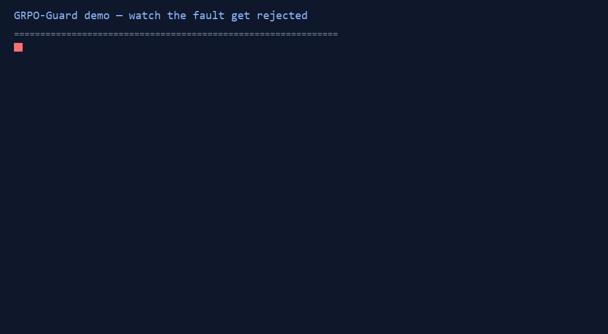

# GRPO-Guard

[](https://github.com/hxm2023/GRPO-Guard/actions)
[](LICENSE)
[](pyproject.toml)
[](https://hxm2023.github.io/GRPO-Guard/)

Trajectory contract, lineage and fault-injection framework for online LLM
post-training (TRL GRPO + vLLM server).

GRPO-Guard builds a **machine-verifiable evidence chain** between the online
training components — trainer / rollout / behavior scoring / reward /
optimizer update — and uses it to detect the silent errors that training
curves cannot reveal:

1. **static rollout policy** — the runtime keeps serving an old policy while
   the trainer updates its weights;
2. **misbound old-logprob** — "old" log-probs that were not produced by the
   behavior policy that generated the trajectory;
3. **retokenization** — the sequence the trainer optimizes is not the
   sequence the server sampled;
4. **mask shift** — completion/action masks that select prompt or padding
   tokens.

It does not reimplement TRL, vLLM or GRPO: it wraps them with content-addressed
artifacts, append-only events, reason-coded validation and a single-use
guarded update handle.

> **Status: v0.4.0 (released).** All three gates (Compatibility /
> Correctness / Impact+Overhead) have passed on autodl2 (2×RTX 6000D) with
> Qwen/Qwen3-4B; the 2026-08-25 evidence audit (docs/audits/) drove the
> P0 fixes: transactional SQLite nonce registry, crash-consistent update
> WAL, actual-input binding (reward/group/model), official-trainer
> input verification, and frozen release packs — all closed in v0.4.0
> (20-step official-path GPU run included).  The authoritative design
> is `GRPO-Guard_详细项目设计与旧项目迁移手册.md` (v1.0).  Every number in
> this README traces to `artifacts/v0.4.0/` (frozen pack) + commit +
> SHA256SUMS; `artifacts/v0.1.0/` is the historical pack (was appended to
> after its release — documented gap, see RELEASE_MANIFEST.json).  This is
> a production-oriented prototype: single-box 2-GPU validation, CPU CI, no
> multi-node/DDP runs yet (docs/PROJECT_INTRO.md honest boundaries).

## The two-project trust chain (GRPO-Guard ↔ Agent-RL Credit Auditor)

GRPO-Guard validates the ONLINE trajectory chain; the
[Agent-RL Credit Auditor](https://github.com/hxm2023/agent-credit-auditor)
validates the OFFLINE estimator claims on the trajectories Guard certifies:

- Guard-issued trajectory envelopes flow through the Auditor's
  `CreditAuditBundle` validation (hash-only references, fail-closed on the
  pinned `grpo-guard-envelope-1.0` schema — the Auditor never forks Guard's
  schema and never writes back).
- The Auditor's trajectory-level audit (`audit-trajectories`) catches the
  Guard online faults that are offline-detectable on the records the
  optimizer consumed: mask shift → T005, misbound old-logprob → S002, stale
  policy_version → T004 (`docs/online_offline_fault_map.md` in the Auditor
  repo).
- The 2026-08 Stage-3 real loop: 18 Guard-supervised GRPO runs whose
  trajectories were then audited by the Auditor.

One trust chain, two projects: Guard makes the trajectory trustworthy,
the Auditor makes the estimator claim trustworthy.

## Architecture

```
Dataset and Split Manifest → TRL GRPO Trainer
  → committed policy v+1 → Checkpoint + PolicyManifest (content-hashed)
  → upstream sync (observed update_named_param) → vLLM Runtime Adapter
  → GenerationEvent + token artifacts (the server's OWN token ids)
  → Append-only Event/Artifact Store
  → Pre-reward Envelope (reference-only) → Identity Validator
     → ALLOW → Reward Adapter → RewardEvent
     → QUARANTINE/REJECT → reason-coded report (never consumed)
  → Pre-update Envelope → Pre-update Validator → ALLOW
  → Guarded Batch Materializer → single-use ValidatedBatchHandle
  → GRPO update (real optimizer step) → UpdateCommitted
  → canary check → v+1 rollout
```

Key invariants (design doc §6-§9):

- **Producer ownership**: the runtime adapter is the only producer of
  generation events and token artifacts; the control plane is the only
  producer of sync/update events; the materializer is the only producer of
  the update input.  No component may rewrite another's output.
- **No re-tokenization**: the optimizer consumes the exact token ids the
  server sampled (via TRL's `VLLMClient.generate` response), with canonical
  masks reconstructed from spans (design doc §7.9).  Text is a read-only
  view for the reward verifier.
- **Reason-coded validation**: P/T/M/L/D/R rule tables; a decision is
  `allow`, `quarantine` or `reject` with machine-readable codes
  (e.g. `P004_STALE_POLICY_STRICT`, `T002_TOKENIZER_MISMATCH`,
  `M004_CANONICAL_MASK_MISMATCH`, `L003_SCORER_POLICY_MISMATCH`).
  Only envelopes with **both** identity and pre-update `ALLOW` may update
  parameters; `guarded_optimizer_step` is the capability-gated optimizer
  entry (handles can only be minted by the materializer).

## Capability status (exact, post-audit)

| Capability | Current status |
|---|---|
| precondition fail-before-backward (non-ALLOW, tampered artifact, reward substitution, wrong group/model, nonce reuse, tokenizer call) | implemented + tested (params provably unchanged) |
| transactional exactly-once nonce across processes | implemented (SQLite, 32-process race test) |
| crash-consistent update lifecycle (WAL PREPARED → APPLIED → CHECKPOINTED → COMMITTED / ABORTED) | implemented + failpoint tests; recovery = discard worker, resume from last committed checkpoint |
| atomic checkpoint promotion (fsync + rename) | implemented |
| in-memory parameter rollback after a failed step | **not claimed** (crash consistency, not DB-style transactions) |
| actual reward/group-size/group-order/model identity bound to the handle | implemented (v0.4.0) |
| official GuardedGRPOTrainer verifies ACTUAL step inputs (tokens / old logprobs / advantages) | implemented + tested; **20-step official-path GPU run**: every step verified, F3 injection blocked before backward at steps 10/19 (`run_packs/p0_4_official_trl/`) |
| persistent nonce across sequential restarts | implemented (legacy JSONL auto-imported) |
| malicious-producer resistance | out of scope (detects silent wiring errors in dev environments) |
- **Deterministic paired replay**: fault pairs are derived from the same
  frozen producer artifacts; gradients are compared with cosine / relative
  L2 / update norm / ratio / clip metrics (`undefined_near_zero` when norms
  ≈ 0 — never fabricated 0).

## Quickstart

```bash
uv sync --frozen          # CPU contract deps (pydantic, numpy, pyyaml)
uv run pytest tests/      # unit + contract + property tests
```

GPU (server mode) requires the compatibility matrix in
`compatibility_profile.yaml` (autodl2: torch 2.11.0+cu130, trl 1.10.0,
vllm 0.26.0, transformers 5.15.1, Qwen3-4B).

```bash
uv run grpo-guard contract-check --cases tests/frozen/f1_f4_v01   # frozen matrix
uv run grpo-guard day3-matrix --loop-dir artifacts/v0.1.0/loop    # gate on real artifacts
uv run grpo-guard replay --manifest artifacts/v0.1.0/run_manifest.json
uv run grpo-guard report --artifact-dir artifacts/v0.1.0
```

## Watch the fault get rejected (40 s, CPU)



Happy path → ALLOW; then F1–F8 injected faults → reject/quarantine with
reason codes; raw text input → `TypeError`.  The F2 case is the point:
misbound logprobs change the loss by ~0 while the guard rejects on
identity — the exact failure numeric monitoring misses.

Full demo: `uv run python examples/countdown/demo.py`

## Single-fault demo

```bash
uv run python - <<'PY'
from grpo_guard import testing
from grpo_guard.faults import inject_f4_mask_shift
from grpo_guard.validators.context import ProtocolConfig, ValidationContext
from grpo_guard.validators.validator import validate_envelope

t = testing.build_trajectory()                      # canonical happy path
f = inject_f4_mask_shift(t, shift=1)                # shift the completion mask by 1
ctx = ValidationContext(envelope=f.envelope, store=f.store, events=f.events,
                        policy_manifest=f.policy_manifest, split_manifest=f.split_manifest,
                        protocol=ProtocolConfig(name="strict_v01", mode="strict_on_policy"))
d = validate_envelope(ctx, "identity_pre_reward").decision_payload
print(d.decision, d.reason_codes)                   # reject ['M002_PROMPT_SELECTED', 'M004_CANONICAL_MASK_MISMATCH']
PY
```

## Results (gate-passed, artifacts in `artifacts/v0.4.0/` — frozen pack)

| Gate | Result | Evidence |
|---|---|---|
| Day 1 Compatibility | TRL+vLLM server-mode smoke green; 1 committed step; **398 observed weight-sync calls** | `smoke/`, `compatibility_profile.yaml` |
| Day 2 Closed loop | v0 rollout → identity ALLOW 32/32 → pre-update ALLOW 32/32 → real update → sync → canary v1 pass → v1 rollout validated | `loop/` |
| Day 3 Correctness | canonical F1–F4 **4/4 reject** (pre-registered codes); 12/12 variants; normal **32/32 ALLOW** (0 false reject); boundary 4/4; stale acceptance 0 | `fault_matrix.json` |
| Day 4 Impact/Overhead | paired gradients: F2 cos 0.989, F3 cos 0.634, F4 cos 0.238 (real model); guard overhead 40.4 ms/batch (3 repeats); F1 update norm 0.0 measured | `replay/`, `overhead.json`, `day4_summary.json` |

## Online experiments (autodl2, real server rollouts)

All runs below executed on autodl2 (2xRTX 6000D) against the REAL vLLM
server (trl vllm-serve + Qwen3-4B), evidence committed under
`artifacts/v0.4.0/` (frozen; historical runs live under `artifacts/v0.1.0/`):

| experiment | result | evidence |
|---|---|---|
| F1-F8 online matrix | F1-F4 4/4 reject, normal 4/4 ALLOW; F5-F8 4/4 (formal v0.2) | `online/fault_matrix_online.json`, `v0.2.0-dev/fault_matrix_online.json` |
| bounded off-policy online | lag≤bound+correction ALLOW; lag>bound reject P005; missing correction reject P006 — 3/3 | `bounded/bounded_online.json` |
| tag v0.1.0 clean smoke | 1 committed step, 398 sync calls (release commit reproduced) | `smoke_v010/smoke_result.json` |
| Day 2/5 guarded closed loop | 32/32 ALLOW → real update → 398-param sync → canary v1 pass → v1 rollout | `loop/` |
| Day 4 paired replay | F2 cos 0.989, F3 cos 0.634, F4 cos 0.238 (real model) | `replay/gradient_replay.json` |
| P008 canary mismatch | perturbed weights → canary drift 32 tokens → validator reject | `canary/canary_mismatch_online.json` |
| canary determinism stress | 10/10 repeated greedy sketches drift 0 (8 prompts incl. near-max-context) | `canary_stress/canary_stress.json` |
| 256-rollout batch matrix (D13) | 256 real rollouts: normal 256/256 ALLOW; F1-F8 injected per trajectory — 2048 decisions all matching the frozen oracle | `batch_online_256/batch_online_matrix.json` |
| multi-step closed loop (D14) | 3× committed update-sync-rollout (v0→v3), 3×398-param sync, 3× canary pass, 1876-token boundary rollout ALLOW | `multi_step/multi_step.json` |
| real RL training (D15/D17) | 19 committed GRPO updates (bounded off-policy lag-1), nonzero loss, real weight delta 10.4, guard ALLOW every step; success curve reported honestly (in-train reward, not held-out) | `rl_training/rl_training.json` |
| P0-fixed RL training (D18) | FULL 20-step rerun: real lag=1 in event chain, 20 committed updates (B=64, micro-batched), 3× interruption+resume; stale-runtime detection (server v0 vs trained v20 → drift 7 → DETECTED) | `rl_training_final/`, `sync_noop/` |
| P1-1 GuardedGRPOTrainer | official TRL GRPOTrainer wrapped at rollout/step/commit seams; 1-step smoke + **20-step official run**: actual step tensors verified per step; F3 retokenization injected at steps 10/19 — both blocked before backward (T001) and recovered | `guarded_trainer/`, `run_packs/p0_4_official_trl/` |
| E1 fault survival | 30-step official runs, F3+F2 injected at steps 10/20 (2 seeds × on/off): guard-on **0/4 bad updates, 0-step latency, 0 wasted steps**; guard-off 4/4 bad updates, 30 wasted steps; ~1% step overhead | `run_packs/e1_fault_survival/` |
| E2 non-inferiority | 5 seeds × on/off, 16-prompt frozen held-out: on 0.250±0.06 vs off 0.288±0.11 (delta within pre-registered margin ≤1/16); train reward on 0.273 vs off 0.263; step +2.3% | `run_packs/e2_non_inferiority/` |
| F1 static-rollout e2e | THE original incident on the official path: sync frozen to BASE weights after step 15 → dual-source attestation flags **STALE_RUNTIME_SUSPECTED** (drift 0.24 vs 0.06 baseline), in-train reward 0.31→0.04 (-88%); F4 mask shift blocked (T001) — **F1-F4 all covered on the official path** | `run_packs/f1_f4_matrix/` |
| P1-2 guard on/off 3-seed | guard-on 0.698±0.049 vs off 0.709±0.050 (delta <1σ — no degradation) | `guard_seeds/` |
| P1-3 tool-use contract | action-only mask, causal order, stale/duplicate/orphan observation detection (deterministic env) | `src/grpo_guard/adapters/tool_env.py` |
| v0.2 variant matrix (F5-F8 ×3 variants) | 12/12 matched, normal 4/4 ALLOW, GATE PASS | `v0.2.0-dev/fault_matrix.json` |

## v0.2: fault families F5-F8 (formal, decision D12)

F5-F8 are FORMAL v0.2 families (D12, 2026-08-23) — the design doc §11
upgrade condition (frozen injection protocol + passing matrix) is met
(`docs/INJECTION_PROTOCOL_v02.md`). CPU-only; NOT part of the v0.1 matrix:

| Fault | Rule | Decision | Evidence |
|---|---|---|---|
| F5 split leakage | `D003_SPLIT_OVERLAP` (+ overlap report) | reject | `tests/frozen/f5_f8_v02/`, `artifacts/v0.2.0-dev/fault_matrix.json` |
| F6 evaluator alias | `R006_EVALUATOR_ALIAS` | quarantine | same |
| F7 event reorder | `L005_SCORING_AFTER_UPDATE` (+P007) | reject | same |
| F8 artifact mutation | `T001_ARTIFACT_HASH_MISMATCH` (isolated store) | reject | same |

`uv run grpo-guard v02-matrix --loop-dir artifacts/v0.4.0/loop` → 4/4 matched,
normal 4/4 allow, GATE PASS.

## v0.2.1: fault families F9-F10 (decision D16)

Task-agnostic families: **F9 reward injection** —
`R008_REWARD_VERIFIER_UNREGISTERED` (a reward event claiming a verifier
not in the registered evaluator registry, or with a wrong protocol hash →
reject); **F10 data poisoning** — `D004_PROMPT_CONTENT_MISMATCH` (the
prompt's token content substituted under the same id vs the frozen
`content_sha256s` registry → reject; this activates the manifest's
previously-unchecked content field).  Frozen fixtures 3/3 + normal 4/4,
GATE PASS (`configs/faults/f9_f10_v01.yaml`, `tests/frozen/f9_f10_v01/`).

## Docker (CPU demo stack)

`Dockerfile` + `docker-compose.yml` package the CPU-only stack: the
`verify` service attests the evidence chain
(`grpo-guard verify --artifact-dir /artifacts/v0.4.0 --events ...`) and
`panel` serves the Streamlit monitor on :8501 with the committed
artifacts mounted read-only.

```bash
docker compose build
docker compose run --rm verify     # checksums + event seals/order/refs
docker compose up panel            # http://localhost:8501
```

The image is built and smoke-tested on every main push by CI
(`.github/workflows/ci.yml` → `docker-demo` job: build, `--help`,
evidence-chain attest inside the image).

## Operations: monitor + alerts

`grpo-guard events --dir <events> [--type --component --code --prompt]`
searches the append-only event log; `grpo-guard alert-scan --dir <events>
--webhook <url>` POSTs every non-ALLOW decision to a webhook
(Slack-compatible or generic JSON).  `examples/monitor/panel.py` is a
Streamlit panel over the event log (decision distribution, reason codes,
lineage tracing, run health) for live demos.

## Task portability

The framework is not bound to Countdown: a second deterministic reward
adapter exists for GSM8K-style math QA (`src/grpo_guard/adapters/
gsm8k_reward.py` — extracts the last numeric value, compares to the
golden answer) with its own protocol hash, frozen samples and event
integration tests (`tests/test_gsm8k_reward.py`,
`tests/test_gsm8k_integration.py`).  The event schema, artifact store,
envelope and validator layers are untouched — the same pipeline binds any
deterministic rule set.

## Limitations (design doc §21)

- The v0.1 update consumed its own policy's trajectories (loss ≈ 0,
  ratio ≈ 1) — the gradient-impact evidence comes from the Day 4 paired
  replay, which runs at v1 weights + a documented deterministic drift.
- The canary is a behavior sketch (greedy tokens), not a per-byte proof.
- F5–F8 are formal v0.2 families (decision D12) but are not part of the
  v0.1 matrix; the v0.1 validator's general checks cover minimal F7/F8
  fixtures.
- No cryptographic tamper-resistance against a malicious producer
  (design doc §5.3).

## Repository layout

```
src/grpo_guard/       schema, store, validators, adapters, faults, replay, CLI
examples/countdown/   smoke + guarded closed-loop scripts
configs/              frozen workload / protocol / fault-matrix configs
tests/                unit, contract, property, frozen cases
artifacts/v0.1.0/     gate evidence (manifests, matrices, checksums)
DECISION_LOG.md       every deviation, recorded before first formal run
```

## License

Apache-2.0.
